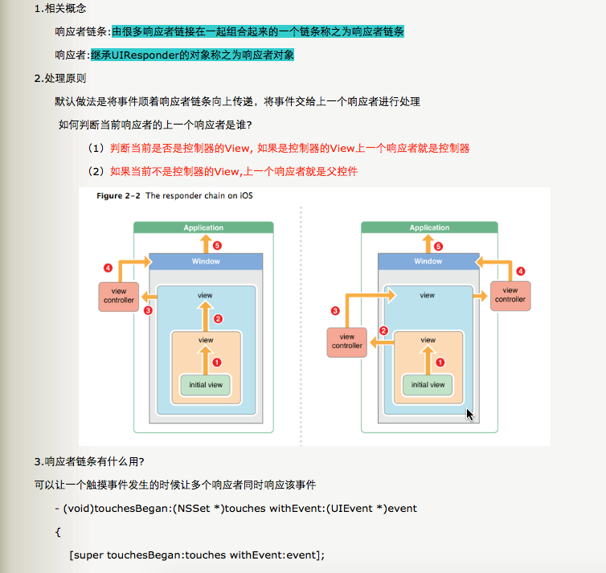

### Pods里没用过的的第三方
- EDStarRating （星级评价）

- JPush （极光推送）
 
- UMengAnalytics （友盟）
 
- IDFA

```
认识一下iOS系统的各种设备识别码：

1、UDID ，全称是 （Unique Device Identifier），顾名思义，它就是苹果IOS设备的唯一识别码，它由40个字符的字母和数字组成，为了保护用户隐私苹果已经禁止读取这个标识了。

2、UUID，全称是（Universally Unique IDentifier），是基于iOS设备上面某个单个的应用程序，只要用户没有完全删除应用程序，则这个 UUID 在用户使用该应用程序的时候一直保持不变。如果用户删除了这个应用程序，然后再重新安装，那么这个 UUID 已经发生了改变。UUID 不好的地方就是用户删除了你开发的程序以后，基本上你就不可能获取之前的数据了。

3、MAC 地址，用来定义网络设备的位置。一个主机会有一个 MAC 地址，MAC 地址是网卡决定的，是固定的，为了保护用户隐私苹果已经禁止读取这个标识了。

4、OpenUDID，不是苹果官方的，是一个替代 UDID 的第三发解决方案， 缺点是如果你完全删除全部带有 OpenUDID SDK 包的 App（比如恢复系统等），那么 OpenUDID 会重新生成，而且和之前的值会不同，相当于新设备；

5、IDFA 广告标示符，适用于对外：例如广告推广，换量等跨应用的用户追踪等。

6、IDFV，Vindor 标示符 (IDFV-identifierForVendor)，来自同一个运营商的应用运行在同一个设备上，此属性的值是相同的；不同的运营商应用运行在同一个设备上值不同。
```
 

#### 自己所了解所知道的
  - 1. 在工程目录种打开 Push Notification

  - 2. 工程目录种 Info 里可以添加相关推送

#### 自己不了解不知道的
 - automaticallyAdjustsScrollViewInsets ，当设置为YES时（默认YES），如果视图里面存在唯一一个 UIScrollView 或其子类View，那么它会自动设置相应的内边距，这样可以让 scroll 占据整个视图，又不会让导航栏遮盖。

  - 当 controller 上的第一个子视图不是scrollview 以及其子类的时候，就会取消内边距。此时原本全屏的 scrollview 设置的frame（0，0，self.view.frame.size.width，xx）就会从状态栏开始算起，如果应用有导航栏的话，那么就会遮盖住视图的64个高度

  - 解决方案:

     - self.automaticallyAdjustsScrollViewInsets = NO;
禁用掉自动设置的内边距，自行控制 controller上index 为0的控件以及 scrollview 控件的位置
     
     - self.edgesForExtendedLayout = UIExtendedEdgeNone;
这种方式设置，不需要再重新设置 index 为0的控件的位置以及scrollview的位置，(0，0) 默认的依然是从导航栏下面开始算起

#### userInteractionEnable
- userInteractionEnabled 中的 User 是指的用户者

- 当前视图设为 view.userInteractionEnabled=NO 时，当前视图不可交互，该视图上面的子视图也不可与用户交互（不可响应即被该视图忽视），响应事件传递到下面的父视图。

- 当前视图设为 view.userInteractionEnabled=YES 时，当前视图可交互，该视图上面的子视图可以用户交互（可以响应即被视图接受），下面的父视图不会接收到响应。

- UIImageView 默认的 userInteractionEnabled 是NO；

- UILabel 默认 userInteractionEnabled 是 NO；

- UIView 的 userInteractionEnabled 默认是 YES。

- 当视图对象的 userInteractionEnabled设置为NO 的时候，用户触发的事件，如触摸事件，键盘弹出事件等，将会被该视图忽略（其他视图照常响应），并且该视图对象也会从事件响应队列中被移除。
- 当 userInteractionEnabled设为YES 时，则事件可以正常的传递给该视图对象。

- **注意：**响应者链是能够响应事件的对象组成的链，事件在该链上传递，最终结果事件或被处理或被抛弃。所以一个对象在不在响应者链里是其能否响应事件的首要前提条件！



### 抢玩APP有以下的BUG：
- 微信登录出问题（微信没权限，最后选择去掉微信）

- App Store 上的版本是四个月前更新的

- 登录的时候键盘一直挡住按钮（用户体验不太好）

- 界面最上端出现 BUG

- 礼包里，点击轮播图后条跳转的界面然后领取礼包码后没有做处理，点击三次后程序直接崩溃


### iOS 从0到1搭建高可用App框架
- [iOS 从0到1搭建高可用App框架](http://www.jianshu.com/p/f09a4f21e0f9)

### UIViewControllerAnimatedTransitioning（自定义转场）
- [ViewController自定义转场－基础](http://www.jianshu.com/p/e7155f938e59)

- [自定义控制器的转场动画（Push、Pop）](http://www.jianshu.com/p/59224648828b)


