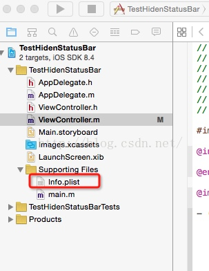

[TOC]


## 隐藏状态栏
-  A push B 隐藏 B 界面的状态栏
 - 在 viewDidLoad 方法添加以下代码：

```
[self prefersStatusBarHidden];  
[self performSelector:@selector(setNeedsStatusBarAppearanceUpdate)];  
```
```
- (BOOL)prefersStatusBarHidden  
{  
    return YES;//隐藏为YES，显示为NO  
}  
```

<!-- more -->

-  所有界面全部隐藏状态栏
 
 - 查看一下有没有这两个 key
 - 没有添加以下：

```
Status bar is initially hidden   （value：YES)

View controller-based status bar appearance   (value:NO)
```


## 禁止WebView滚动

```
UIScrollView *tempView = (UIScrollView *)[self.myWebView.subviews objectAtIndex:0];

tempView.scrollEnabled = NO;
```

## 添加支付白名单
- info.plist 文件右键
- open AS
- Source Code
- 添加以下代码

```
 <key>LSApplicationQueriesSchemes</key>
    <array>
        <string>alipays</string>
        <string>alipayauth</string>
        <string>alipay</string>
        <string>alipayqr</string>
        <string>alipays</string>
        <string>weixin</string>
        <string>wechat</string>
        <string>sinaweibohd</string>
        <string>sinaweibo</string>
        <string>sinaweibosso</string>
        <string>sinaweibohdsso</string>
        <string>weibosdk</string>
        <string>weibosdk2.5</string>
        <string>mqqapi</string>
        <string>mqq</string>
        <string>mqqOpensdkSSoLogin</string>
        <string>mqqconnect</string>
        <string>mqqopensdkdataline</string>
        <string>mqqopensdkgrouptribeshare</string>
        <string>mqqopensdkfriend</string>
        <string>mqqopensdkapi</string>
        <string>mqqopensdkapiV2</string>
        <string>mqqopensdkapiV3</string>
        <string>mqzoneopensdk</string>
        <string>wtloginmqq</string>
        <string>wtloginmqq2</string>
        <string>mqqwpa</string>
        <string>mqzone</string>
        <string>mqzonev2</string>
        <string>mqzoneshare</string>
        <string>wtloginqzone</string>
        <string>mqzonewx</string>
        <string>mqzoneopensdkapiV2</string>
        <string>mqzoneopensdkapi19</string>
        <string>mqqopensdkapiV4</string>
        <string>mqzoneopensdkapi</string>
        <string>mqqbrowser</string>
        <string>mttbrowser</string>
    </array>
```

## OC 简单的调用 Web 网页 基础方法
- 添加 ==WebKit.weFrameWork== 框架
- 导入头文件 `#import <WebKit/WebKit.h>`
- 创建 WKWebView 并且将其设置成 View

```
WKWebView *WKWeb = [[WKWebView alloc] initWithFrame:[UIScreen mainScreen].bounds];    
self.view = WKWeb;
NSURLRequest *request = [NSURLRequest requestWithURL:[NSURL URLWithString:@"https://www.baidu.com"]];
[WKWeb loadRequest:request];
```


