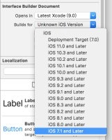

# 2017-12-13 - 真机调试、唯一标识符、WKWebView
<!-----
layout: post
title: "真机调试、唯一标识符、WKWebView"
date: 2017.12.13
tag: iOS 总结 
--- -->
[TOC]

<!-- more -->
## 真机调试问题

```
Your maximum App ID limit has been reached. 
You may create up to 10 App IDs every 7 days.
```
 - 1.出现这种情况,直接用上一次的 Bundle ID 就行了,因为免费 App ID 账号苹果官方有所限制

 - 2.这个时候你不管怎么改变 Bundle ID 都没有用,直接更换以前调试过的 Bundle ID ,就可以搞定了,建议每创建 Bundle ID 就记录一下,当出现这种问题的时候直接更换就可以了
## 唯一标识符
- [iOS获取设备唯一标识的各种方法？IDFA、IDFV、UDID分别是什么含义？](https://www.cnblogs.com/zxykit/p/5320259.html)
- 目前在项目中使用的比较多的也就数 IDFV 了,其他的几个基本都被苹果淘汰了.
同时关于 UUID ,因为保证对在同一时空中的所有机器都是唯一的,所以在程序安装的时候生成唯一的 UUID 并且保存在 keychain 中,以这个唯一的 UUID 作为唯一标识符,就可以用于判断唯一设备.变相的作为 UDID 的用法
- [iOS-理解 : UDID、UUID、IDFA、IDFV](http://www.jianshu.com/p/b810d7e007ad)
## XIB 报错
```
error: Illegal Configuration: Compiling IB documents for earlier than iOS 7 is no longer supported.
```
- 修改最低版本    
 
 

## WKWebView 问题
```
   NSString *strRequest = [navigationAction.request.URL.absoluteString stringByReplacingPercentEscapesUsingEncoding:NSUTF8StringEncoding];
    if([strRequest isEqualToString:@"about:blank"]) {//主页面加载内容
        decisionHandler(WKNavigationActionPolicyAllow);//允许跳转
    } 
    else {//截获页面里面的链接点击
        //do something you want
        decisionHandler(WKNavigationActionPolicyCancel);//不允许跳转
    }
```

