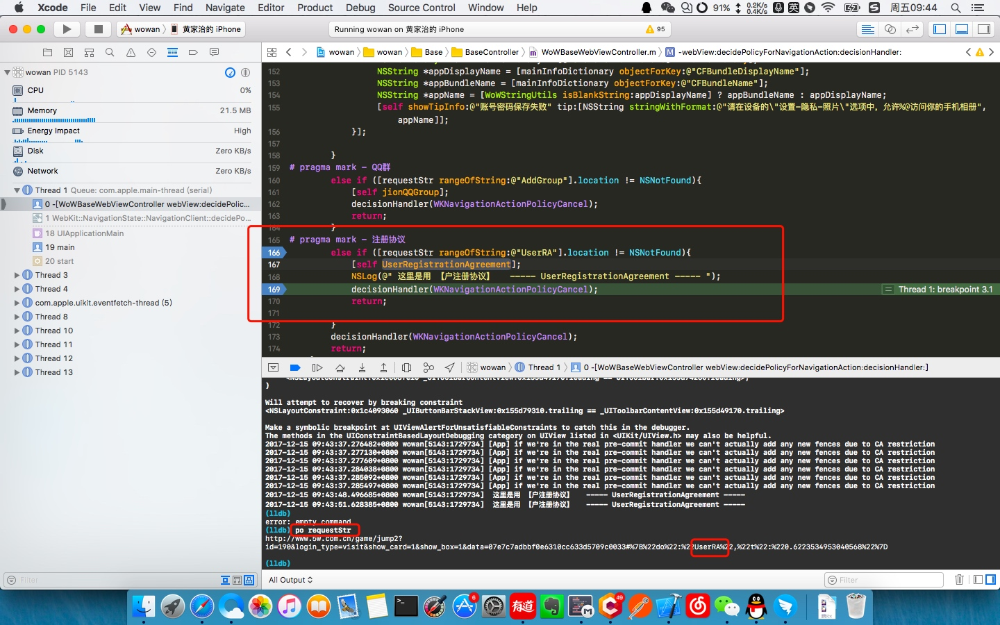

[TOC]


## 字符串拼接
- 方法一：

```
- 错误的写法：string = [NSString initWithFormat:@"%@,%@", string1, string2 ];

- 正确的写法：string = [[NSString alloc] initWithFormat:@"%@,%@", string1, string2 ];

- 还有一种方法：NSString *string = [NSString stringWithFormat: @"%@%@", string1, string2];
```
- 方法二：

```
string = [string1 stringByAppendingString:string2];
```
- 方法三：

```
string = [string stringByAppendingFormat:@"%@,%@",string1, string2];
```
## IDFA 的获取方法
- 之前用的是 IDFV


- IDFA

```
NSString *idfa = [[[ASIdentifierManager sharedManager] advertisingIdentifier] UUIDString];
```

<!-- more -->

## 与后台的联调
- 首先是方法名的定义 "jionGroup"、"UserRA" 等
- 其次在需要交互的地方写好,调用方法就 OK

```
#pragma mark - 在发送请求之前，决定是否跳转
- (void)webView:(WKWebView *)webView decidePolicyForNavigationAction:(WKNavigationAction *)navigationAction decisionHandler:(void (^)(WKNavigationActionPolicy))decisionHandler 

- else if ([requestStr rangeOfString:@"AddGroup"].location != NSNotFound) // 这里写 AddGroup 的方法

- else if ([requestStr rangeOfString:@"UserRA"].location != NSNotFound) // 这里写 UserRA 的方法
```
## 调试
- 断点是最常见的
- 断点停止地方如果想打印数据
- LLDB 调试

```
控制台 po requestStr
```



