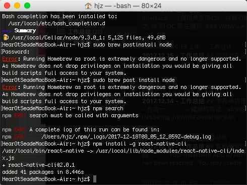
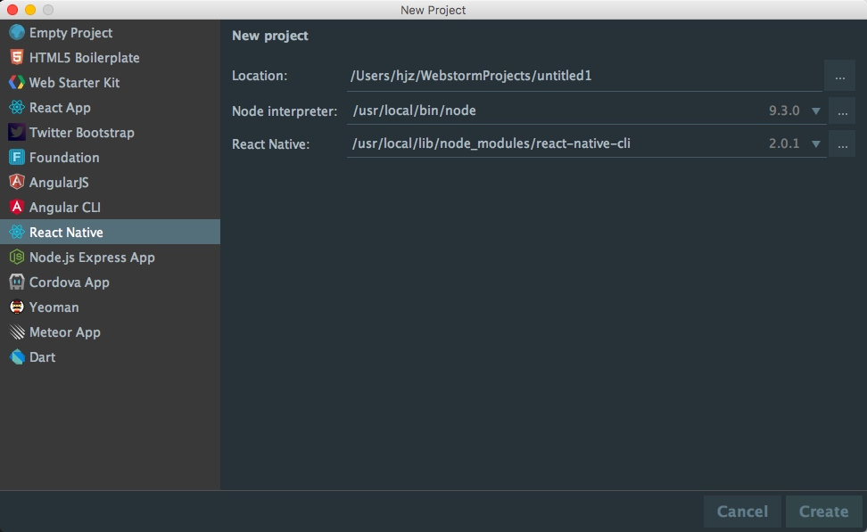
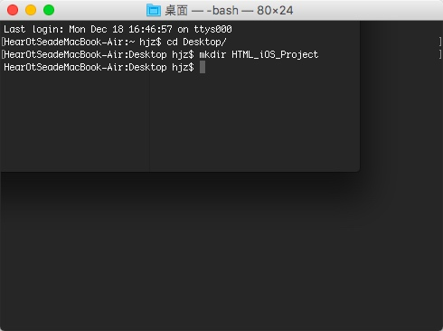

# 2017-12-18 白鹭引擎
<!-----
layout: post
title: "白鹭引擎"
date: 2017.12.18
tag: iOS 总结 
--- -->

[TOC]

<!-- more -->
## call External Interface -（调用外部接口）
白鹭引擎之 JS 和 OC 原生通讯

### WebView 模式 Objective-C 调用 JS 方法

**在 JS 中定义全局的回调函数**

```
window.callJS = function(msg) {
  console.log(msg);  
};
```
**在 Objective-C 中调用全局的回调函数**

```
- (void)callExternalInterface:(NSString*)funcName Value:(NSString*)value;
```

其中，funcName表示调用函数名字的字符串和value是传递给被调用函数的参数字符串。经过上面两步，就实现了在Objective-C调用JS函数。调用前面注册的callJS函数的示例代码如下：

```
[super.launcher callExternalInterface:@"callJS" Value:@"message from native"];
```
其中，launcher变量仍然来自于NativeViewController类。

## 熟悉的 WebStrom



出现这种原因是因为需要手动下载一次 Node.js 然后自行安装过后再输入命令行

-  `npm install -g react-native-cli`


## Egret - iOS - Support 
### 打包 iOS app
egret-ios-support是Egret打包为原生ios APP的方案，使用egret-ios-support 可以将HTML5游戏打包为ipa文件，并提供给用户安装。

本文会完整的展示如何在一个已经安装npm管理包的环境中全新安装Egret核心包、Egret的iOS支持包，最终在模拟机中运行Demo的过程。

本文主要包含三部分：第一部分为iOS开发环境的安装、第二部分为Egret游戏框架的安装、第三部分创建一个完整iOS App的示例。

#### 1. 预备知识
为了顺利完成本教程，请确认您已熟练掌握以下知识：

- 为了顺利完成本教程，请确认您已熟练掌握以下知识：

- 了解终端、命令行、Shell其中之一，会启动她，并能通过命令行执行的方式完成上一条的相关操作

- 了解如何下载文件并解压缩文件

- 了解以下术语：

 - 编写游戏逻辑需要：JavaScript、TypeScript、nodejs、npm

 - 打包iOS App需要：Objective-C、C++、Xcode

#### 2. iOS 开发环境安装
**安装iOS开发环境——Xcode**


#### 3. 安装 Egret 游戏框架
**预备知识**
打开终端，cd 到桌面，创建一个你要为之打包的目录 

==`mkdir HTML_iOS_Project`== 如下图：




