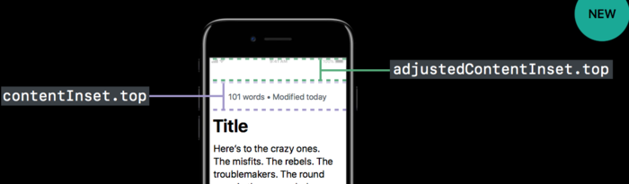

# 2017-12-28 - iPhone X 适配问题
<!-----

layout: post
title: "iPhone X 适配问题"
date: 2017.12.28
tag: iOS 总结

--- -->


- 1. Safe Area
- 2. table
- 3. Navigation
 - Navigation 集成 UISearchController
 - UINavigationController和滚动交互
- 4. UIScrollView and UITableView的新特性
 - 如果有一些文本位于UI滚动视图的内部，并包含在导航控制器中，现在一般 `navigationContollers` 会传入一个 `contentInset` 给其最顶层的`viewController` 的 `scrollView`，在iOS11中进行了一个很大的改变，不再通过 `scrollView` 的 `contentInset` 属性了，而是新增了一个属性： `adjustedContentInset`，通过下面两种图的对比，能够表示 `adjustContentInset` 表示的区域：

    

- 新增的contentInsetAdjustmentBehavior属性用来配置adjustedContentInset的行为，该结构体有以下几种类型：

```
typedef NS_ENUM(NSInteger, UIScrollViewContentInsetAdjustmentBehavior) {  
    UIScrollViewContentInsetAdjustmentAutomatic, 
    UIScrollViewContentInsetAdjustmentScrollableAxes,
    UIScrollViewContentInsetAdjustmentNever,
    UIScrollViewContentInsetAdjustmentAlways,
}

@property(nonatomic) UIScrollViewContentInsetAdjustmentBehavior contentInsetAdjustmentBehavior;
@property(nonatomic, readonly) UIEdgeInsets adjustedContentInset；

//adjustedContentInset值被改变的delegate
- (void)adjustedContentInsetDidChange; 
- (void)scrollViewDidChangeAdjustedContentInset:(UIScrollView *)scrollView;
```


