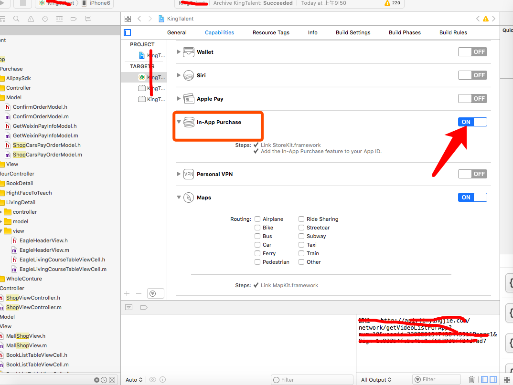

[TOC]


## ERROR： -999
- ==NSURLErrorCancelled== 就是 -999，它代表请求被取消的意思。
 - 根本原因

 - 出现 `NSURLErrorDomain Code = -999` 的根本原因是什么呢？

 - 其实就是因为webview在之前的请求还没有加载完成，下一个请求发起了，此时webview会取消掉之前的请求，因此会回调到失败这里。

 - 因此，在处理Webview的加载失败的回调时，要注意拦截掉被取消的请求。

<!-- more -->

- 解决方案
  - 在webview加载失败时，添加如下代码来判断：

```
- (void)webView:(UIWebView *)webView didFailLoadWithError:(NSError *)error {
  [self stopAnimating];
  
  // 如果是被取消，什么也不干
  if([error code] == NSURLErrorCancelled)  {
    return;
  }
  
  // 后续失败处理
}
```


## UIView 动画
- 动画相关

    

## 苹果内购
### 整体流程
**第一部分** - iTunes Connect 配置

- 1. 进入 itunes Connect 的【协议、税务和银行业】填写相关信息

- 2. 今日 【我的APP】-【功能】-【APP 内购买项目】- 选择自己所需要添加的内购的类型

- 3. 填写好这几项，需要记录下每个产品的内购ID，也就是唯一ID，为以后购买产品做准备。

- 4. 在工程中配置好证书
    

**第二部分** - 代码块

1. 头件 `“#import<StoreKit/StoreKit.h>”`

2. 引入 `"SKProductsRequestDelegate,SKPaymentTransactionObserver"` 这两个代理

3. 我们需要在内购的那个页面viewDidLoad方法里直接调用方法:
    


4. 然后接下来就是几个最重要的代理方法了，如果正常的内购能够走通，那么这几个代理方法就会很流畅的运行过去，并且返回你所购买的商品的信息。
       
    
    
    
    
    
    

**第三部分** - 常见错误总结

1. 请求不到内购的产品信息。

 - 解决办法：
  - （1） 先看看 ==bundle id==，和测试证书之类的东西配置的都对不对，然后看看产品的唯一 ==ID== 和 ==iTunesConnect== 里的能不能对应上。如果都没有问题，那么看下面的。

  - （2） 去看看 ==iTunesConnect== 里的协议里面的公司的地址信息和银行卡信息是否填写正确，只要没有报错，报红就可以。基本上上面这几点弄好了也就能请求到商品了。

2. 手机提示无法连接到==itunesStore==
 - 解决办法：把手机的 ==Apple ID== 先注销掉，然后购买的时候重新填写 ==Apple ID==。


