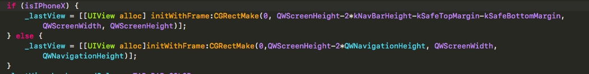

---
layout: post
title: "工作总结"
date: 2018-01-06
tag: 博客
---   

## 我玩
- 适配 iPhone X
 - ==X== 不变
 - ==Y== 是 ==NavgationBarHeight==
 - ==Width== 全屏宽度
 - ==Height== 全屏高度

## 隐藏 iPhone X 小白条
```
# pragma mark - 隐藏 iPhone X 小白条
- (BOOL)prefersHomeIndicatorAutoHidden
{
    return YES;
}

- (UIRectEdge)preferredScreenEdgesDeferringSystemGestures
{
    return UIRectEdgeAll;
}
```
==注意：== 这里的方法要写在要加载的 ==ViewController== 里才可以实现
## LuanchImage
```
iphone X (Retina HD 5.5 @3x): 1125 x 2436
iPhone 6Plus/6SPlus(Retina HD 5.5 @3x): 1242 x 2208
iPhone 6/6S/(Retina HD 4.7 @2x): 750 x 1334
iPhone 5/5S(Retina 4 @2x): 640 x 1136
iPhone 4/4S(@2x): 640 x 960
```

```
*Device*                    *Portrait*                *Landscape size*
------------------------------------------------------------------------------
12.9" iPad Pro              2048px × 2732px          2732px × 2048px
10.5" iPad Pro              1668px × 2224px          2224px × 1668px
9.7" iPad                   1536px × 2048px          2048px × 1536px
7.9" iPad mini 4            1536px × 2048px          2048px × 1536px
iPhone X                    1125px × 2436px          2436px × 1125px
iPhone 8 Plus               1242px × 2208px          2208px × 1242px
iPhone 8                    750px × 1334px           1334px × 750px
iPhone 7 Plus               1242px × 2208px          2208px × 1242px
iPhone 7                    750px × 1334px           1334px × 750px
iPhone 6s Plus              1242px × 2208px          2208px × 1242px
iPhone 6s                   750px × 1334px           1334px × 750px
iPhone SE                   640px × 1136px           1136px × 640px

注意：在调整750*1334图片大小的时候 默认大小会变成750*1333 一定要改成1334否则会影响应用内字体颜色和大小
```
## 抢玩
- 适配 ==iPhone== X
 - 底部的 ==StatusbBarHeight== 高度计算



