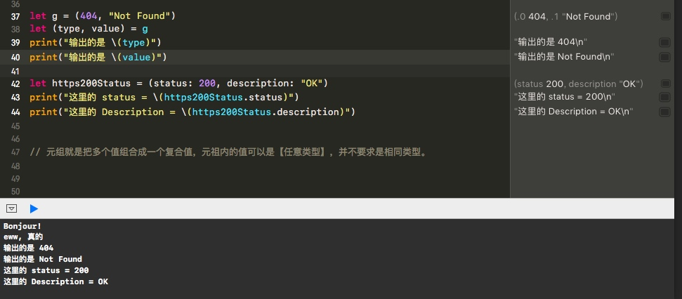

---

layout: post
title: "Swift 4.0 学习笔记"
date: 2018.01.15
tag: iOS 总结
---

[TOC]


### 1 - 元祖
#### **元组就是把多个值组合成一个复合值，元祖内的值可以是【任意类型】，并不要求是相同类型。**



### 2 - 可选类型
#### Swift 中的 nil 不同于 OC 中的 nil。
-  在 OC 中，nil 是一个**指向不存在的对象的指针**。 
-  在 Swift 中，nil 不是指针, 它是**一个不存在值的特定类型的**。 任何数据类型的可选类型都可以设置为 nil，而不仅仅是对象类型。
  

<!-- more -->

### 3 - If 语句和强制解包
#### 使用  ==（！）==  时，访问不存在值的可选类型会触发运行错误, 所以在使用==（！）== 强制解包前, 要==始终确保==可选类型包含了非空的值。
- 当你确定可选类型确实有值,你可以通过在可选类型名称的末尾添加感叹号==（!）==来访问其包含的值。这个感叹号如同在宣称：**“我知道这个可选类型肯定有值，请使用它。”** 
- 这被称为可选类型的强制解包：


### 4 - 可选绑定
1. **你可以使用可选绑定来确定可选类型是否包含值，如果这样做，你必须把这个绑定的值用作临时常量或变量**

2.

```
# 可选绑定可以与if-while 语句一起使用，
# 以检查可选类型中的值，
# 并作为这个操作的一部分将该值提取为常量或变量。
```
3.

这段代码可以这样理解：

- 如果 ==Int(h)== 方法返回的可选Int包含一个值，创建一个名为==actualNumber==的新常量并设置其值为可选类型包含的值。

- 如果转换成功，则常量==actualNumber==可用于 ==if语句==的第一个分支中。它已经通过可选类型中的值初始化了，所以没有必要使用==`(！)`==后缀访问其值。在这个例子中，==actualNumber== 只简单地用于打印转换后的结果。

4. **在 if 语句中使用可选绑定创建的常量和变量仅在 if 语句的主体内可用。
相比之下，使用 guard 语句创建的常量和变量可以在 guard 语句后面
的代码中使用**

### 思考：Xib Storyboard 纯代码

```
# 其实完全不需要做一个“艰难的决定”，你可以像 QQ 和微信那样，根据具体情况来选择性的使用 xib 和 storyboard

# 一些建议：

# 对于复杂的、动态生成的界面，建议使用手工编写界面，但一定要注意view和业务层的分离

# 对于需要统一风格的按钮或UI控件，建议使用手工用代码来构造。增加复用性和通用性。

# 对于需要有继承或组合关系的 UIView 类或 UIViewController 类（例如baseview），建议用代码手工编写界面。

# 对于那些简单的、静态的、非核心功能界面，可以考虑使用 xib 或 storyboard 来完成。
```

### Swift 算术运算符简写


- 如果 `hasHeader` 这个条件成立 `contentHeight` 就要比 `rowHeight` 高 50， 否则就比 `rowHeight` 高 20


