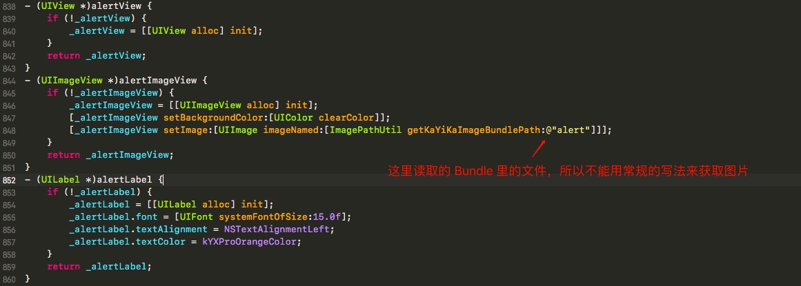
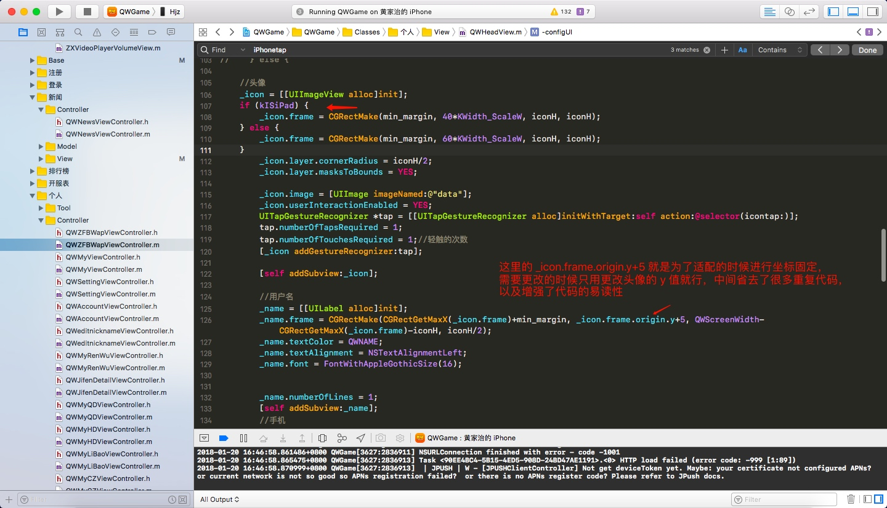

## 暖暖娃娃机
- 登录界面问题
    

- 登录界面布局


<!-- more -->

## UIAlertVIewController 使用

```
UIAlertController *alertController = [UIAlertController alertControllerWithTitle:nil message:@"请填写评论" preferredStyle:UIAlertControllerStyleAlert];

UIAlertAction *cancelAction = [UIAlertAction actionWithTitle:@"确定" style:UIAlertActionStyleCancel handler:nil];

[alertController addAction:cancelAction];

[self presentViewController:alertController animated:YES completion:nil];

```


## iPad 版本适配
- 适配所遇到的问题



## userInteractionEnabled 属性
- [视图userInteractionEnabled交互](https://www.jianshu.com/p/febef5ce9adc)

