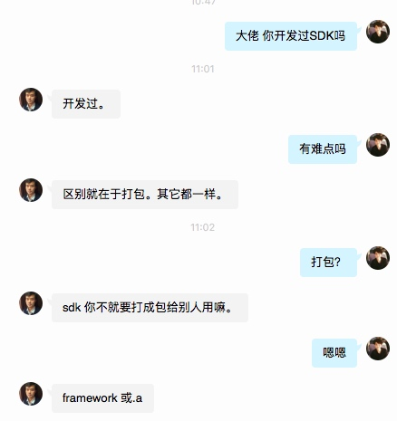

---
layout: post
title: "第一次接触 SDK 开发"
date: 2018.01.22
tag: 工作
---   

## adjust SDK 接入
- 接入 初始化
- YourAppToken 是后台创建的 iOS 端只需要调用就行


## SDK 开发

```
在SDK开发中，一般会需要经过几个流程，

# 开发SDK
# 测试SDK
# 把SDK交付给使用人员

这些东西看似步骤多，过程繁琐，而且每修改一次SDK就需要重复一次上述的过程，增加了一些不必要的操作。

当然，如果我们在SDK设计之初就有一个好的项目架构，就可以极大简化开发流程，提高开发效率.
```

- [一种比较实用的iOS SDK项目架构](https://www.jianshu.com/p/edc679a893c9)

- 开发 SDK
 - 一般都是 .a
 - 有的需求打包成 framework
 


## pushToViewControllerWhenClickPushMessageWith - 这个是极光推送的方法
```
#pragma mark -- 程序点击推送消息进入的方法
// iOS 10 Support
- (void)jpushNotificationCenter:(UNUserNotificationCenter *)center didReceiveNotificationResponse:(UNNotificationResponse *)response withCompletionHandler:(void (^)())completionHandler {
    // Required
    NSDictionary * userInfo = response.notification.request.content.userInfo;
    if([response.notification.request.triggerisKindOfClass:[UNPushNotificationTriggerclass]]) {
        [JPUSHServicehandleRemoteNotification:userInfo];
        
         [selfpushToViewControllerWhenClickPushMessageWith:userInfo]; //跳转页面
    }
    completionHandler();  // 系统要求执行这个方法
}

#pragma mark -- 程序跳转方法
-(void)pushToViewControllerWhenClickPushMessageWith:(NSDictionary*)msgDic{
    
    //将字段存入本地，因为要在你要跳转的页面用它来判断
   NSUserDefaults*pushJudge = [NSUserDefaultsstandardUserDefaults];
  //  [pushJudge setObject:@"push"forKey:@"push"];
//判断后台传送的标示（用于跳转哪一个页面的判断）
    if ([[msgDicobjectForKey:@"type"]isEqualToString:@"active"]){
//得到根部控制器
        TabBarController *hxl=(TabBarController *)self.window.rootViewController;
//得到控制器中的导航栏
        UINavigationController *nav=hxl.selectedViewController;
//得到导航栏对应的控制器
        UIViewController  *controller=(UIViewController *)nav.visibleViewController;
//进行跳转页面
        TSProductDetailViewController *pro=[[TSProductDetailViewControlleralloc]init];
        
         pro.detailid=[[msgDicobjectForKey:@"id"]integerValue];        
        [controller.navigationControllerpushViewController:pro animated:YES];
      
    }elseif ([[msgDicobjectForKey:@"type"]isEqualToString:@"dynamics"]){
        TabBarController *hxl=(TabBarController *)self.window.rootViewController;
        hxl.selectedIndex=2;
    }
}

#pragma mark iOS 10 前台收到通知（远程推送和本地通知）
- (void)jpushNotificationCenter:(UNUserNotificationCenter *)center willPresentNotification:(UNNotification *)notification withCompletionHandler:(void (^)(NSInteger))completionHandler {
    NSDictionary * userInfo = notification.request.content.userInfo;
    if([notification.request.triggerisKindOfClass:[UNPushNotificationTriggerclass]]) {
        /// iOS10处理远程推送
        [JPUSHServicehandleRemoteNotification:userInfo];
        /// 前台收到推送的时候转成本地通知 ===========================
        [self popAlert:userInfo];
        
    }else{
        /// iOS10处理本地通知添加到通知栏 ==============================
        completionHandler(UNNotificationPresentationOptionBadge|UNNotificationPresentationOptionSound|UNNotificationPresentationOptionAlert);
        
        
    }
    // 需要执行这个方法，选择是否提醒用户，有Badge、Sound、Alert三种类型可以选择设置
}

//在前台的时候 我这里就直接弹出提示框
-(void)popAlert:(NSDictionary *)pushMessageDic{
    NSLog(@"%@",pushMessageDic);
    NSString *title;
    if([[pushMessageDicobjectForKey:@"type"]isEqualToString:@"active"])
    {
     title=@"您有新的活动推送";
        [JCAlertViewshowTwoButtonsWithTitle:titleMessage:             [[pushMessageDicobjectForKey:@"aps"]objectForKey:@"alert"]ButtonType:JCAlertViewButtonTypeCancelButtonTitle:@"取消"Click:^{
            
        } ButtonType:JCAlertViewButtonTypeDefaultButtonTitle:@"查看"Click:^{
            [selfpushToViewControllerWhenClickPushMessageWith:pushMessageDic];
            
        }];
    }elseif([[pushMessageDic objectForKey:@"type"]isEqualToString:@"dynamics"]){
        title=@"您有新的评论消息";
        [JCAlertViewshowOneButtonWithTitle:titleMessage:[[pushMessageDicobjectForKey:@"aps"]objectForKey:@"alert"]ButtonType:JCAlertViewButtonTypeCancelButtonTitle:@"取消"Click:^{
            
        }];
      
    }
    
   
}
```


## 测试数据
- 后台给了个接口
 - 传进 IDFA 用来收集用户注册激活数据


  


1- 
2 - 

3 - 

4 - 

## 架构

- [转：APP架构经验总结](http://keeganlee.me/post/architecture/20160303)


