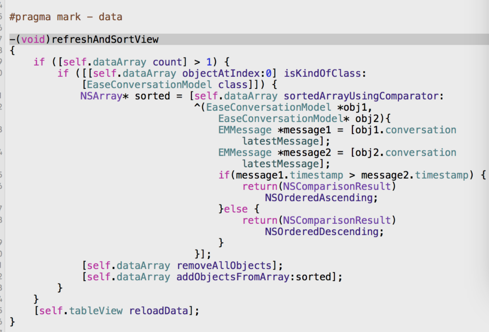

# 2018-02-26-UIImagePickerController 与 AVFoundation 的区别
<!-----
layout: post
title: "UIImagePickerController 与 AVFoundation 的区别"
date: 2018.02.26
tag: iOS 总结
----->

[TOC]

<!-- more -->
## UIImagePickerController 与 AVFoundation 的区别
今天在一个iOS 交流群里看到有人说

```
现在很少用 ImagePicker 了 

一般都用 AVFoundation

原因是：这个imagepicker不太好用
```
然后我就在网上搜了一下，找到了一片干货，废话不多说，咱们来看

- [AVFoundation](https://www.jianshu.com/p/f7146092e640)

emmm...这个是音频的，群里的问题是关于相册的，那我们来看下关于相册的文章

- [iOS保存到相册／创建自定义相簿](https://www.jianshu.com/p/7e5b1a7f3b92)

以下这篇文章说的比较片面，最主要是个大概的了解

- [iOS 上的相机捕捉 UIImagePickerController 与 AVFoundation的区别](http://blog.csdn.net/leikezhu1981/article/details/44493659)

所以我们最后可以总结：

```
# 不得不说UIImagePickerController确实强大，但是与MPMoviePlayerController类似，由于它的高度封装性，要进行某些自定义工作就比较复杂了。

# 例如要做出一款类似于美颜相机的拍照界面就比较难以实现了，此时就可以考虑使用AVFoundation来实现。

# AVFoundation中提供了很多现成的播放器和录音机，但是事实上它还有更加底层的内容可以供开发者使用。

# 因为AVFoundation中抽了很多和底层输入、输出设备打交道的类，依靠这些类开发人员面对的不再是封装好的音频播放器AVAudioPlayer、录音机（AVAudioRecorder）、视频（包括音频）播放器AVPlayer，而是输入设备（例如麦克风、摄像头）、输出设备（图片、视频）等。
```


扩展学习资料

- [iOS 保存原图到相册](https://www.jianshu.com/p/2dc960540e68)

## 伪代码
### 什么叫伪代码？
- 今天在交流群里那些大佬们在 【斗代码】于是乎我看不懂他们所说的是啥就去问我师父，结果他跟我讲解的时候有个【伪代码】这个字眼，我瞬间懵逼了，于是就有了以下是资料查询

- 由于最近找工作，面试时面试官提问时让我用伪代码回答他所提的问题，当时笔者就蒙了，满脑子就是问号，相信有部分童鞋和笔者差不多，当然大多数童鞋都是好孩子，应该都知道，于是笔者赶紧回来查了一下官方解释如下：

- 伪代码（Pseudocode）是一种算法描述语言。是用介于自然语言和计算机语言之间的文字和符号（包括数学符号）来描述算法。使用伪代码的目的是使被描述的算法可以容易地以任何一种编程语言（Pascal，C，Java等）实现。因此，伪代码必须结构清晰、代码简单、可读性好，并且类似自然语言。 介于自然语言与编程语言之间。以编程语言的书写形式指明算法职能。使用伪代码， 不用拘泥于具体实现。

- 【简单示例】输入3个数，打印输出其中最大的数。可用如下的伪代码表示：

```
Begin
输入 A，B，C
IF A>B 则 A→Max
否则 B→Max
IF C>Max 则 C→Max
Print Max
End 。

我师父给出的解释是：

如果她爱我，我就爱她，如果她不爱我，那我也不爱她
```
- 笔者理解为简单的计算机语言，人类语言以及逻辑符号来表示的流程说明。当然朋友们有更好的理解也可以指出来！

## 群里在斗代码 哼哼

- 第一个如下：
    - 写一个函数输出一个数字中的数字组合的下一个最大组合。
    
    - 例如378的下一个最大的组合是387，12下一个最大的组合是21，如果没有更大的组合就返回-1


### Python：解法
```
import random

 """

    写一个函数输出一个数字中的数字组合的下一个最大组合。例如378的下一个最大的组合是387，71632下一个最大的组合是72136，如果没有更大的组合就返回-1（语言不限）

    例子分析：71632

    1、从数字后面往前看，如果一直递增则没有更大的组合，返回－1

    2、若发现更小的，比如上面1比6小，则从1后面的数字6、3、2中找出比1大的那个最小数为2，然后对剩下的数字1、3、6进行从小到大排序，最终组合为72136

"""

 def nextMaxCount(num):# 例子：4565321

    if num < 10:

        return -1

    L = [int(n) for n in str(num)] # L: [4,5,6,5,3,2,1]

    for i in range(len(L))[::-1]:

        if i == 0:

            return -1

        if L[i] > L[i-1]:

            newL = L[i:]    # newL: [6,5,3,2,1]

            currentNum = L[i-1]

            findNum = -1

            for j in range(len(newL))[::-1]:

                findNum = newL[j]

                if findNum > currentNum:

                    newL.pop(j)     # newL: [5,3,2,1]

                    newL.append(currentNum)# newL: [5,3,2,1,5]

                    newL = sorted(newL)# newL: [1,2,3,5,5]

                    break

            targetL = L[:i-1]

            targetL.append(findNum)

            targetL = tar
getL + newL

            s = ""

            for n in targetL:

                s = s + str(n)

            return s

 for i in range(10):

    randomNum = random.randint(0,1000000)

    nextCout = nextMaxCount(randomNum)

    print(str(randomNum) + "--->" + str(nextCout))
```
 

### OC解法：
```
// 写一个函数输出一个数字中的数字组合的下一个最大组合。
// 例如378的下一个最大的组合是387，71632下一个最大的组合是72136，如果没有更大的组合就返回-1（语言不限）

/*

    例子分析：71632

    1、从数字后面往前看，如果一直递增则没有更大的组合，返回－1

    2、若发现更小的，比如上面1比6小，则从1后面的数字6、3、2中找出比1大的那个最小数为2，然后对剩下的数字1、3、6进行从小到大排序，最终组合为72136

*/

- (NSUInteger)nextMaxCountWithNum:(NSUInteger)num{ // 例子：4565321

    if (num < 10) {

        return -1;

    }

    NSMutableArray *nums = @[].mutableCopy;

    while (num) {

        [nums insertObject:@(num % 10) atIndex:0];

        num /= 10;

    }

    for (NSInteger i = nums.count - 1; i >= 0; i--) {// nums: [4,5,6,5,3,2,1]

        if (i == 0) {

            return -1;

        }

        if (nums[i] > nums[i - 1]) { // i = 2

　　      NSNumber *currentNum = nums[i-1];

            NSMutableArray *lastArr = [nums subarrayWithRange:NSMakeRange(i, nums.count - i)].mutableCopy;// lastArr: [6,5,3,2,1]

            NSNumber *findNum = 0;

            for (NSInteger j = lastArr.count - 1; j >= 0; j--) {

                NSNumber *findN = lastArr[j];

                if (findN > currentNum) {

                    findNum = findN;                 // findNum: 6

                    [lastArr removeObjectAtIndex:j]; // lastArr: [5,3,2,1]

                    [lastArr addObject:currentNum];  // lastArr: [5,3,2,1,5]

                    break;

                }

            }

            [lastArr sortUsingComparator:^NSComparisonResult(NSNumber *obj1, NSNumber *obj2) {// lastArr: [1,2,3,5,5]

                return obj1.integerValue > obj2.integerValue;

            }];

            NSMutableArray *targetArr = @[].mutableCopy;

            [targetArr addObjectsFromArray:[nums subarrayWithRange:NSMakeRange(0, i-1)]];// targetArr: [4]

            [targetArr addObject:findNum];                                               // targetArr: [4,6]

            [targetArr addObjectsFromArray:lastArr];                                     // targetArr: [4,6,1,2,3,5,5]

            NSString *targetStr = [targetArr componentsJoinedByString:@""];

            return targetStr.integerValue;

        }

    }

     return -1;

}
```


- 第二个如下：
    - 怎么判断是 5s和2倍屏下字体小一号

    - 或者ipad上运行iPhone项目的时候也是属于2倍屏 需要字体小一号

    - 手机高度和宽度的比例

```
.h 文件

+ (CGFloat)phoneHeightScale;
//手机字体的比例
+ (CGFloat)phoneFontScale;
+ (PhoneType)phoneType;
```
```
.m 文件

+ (CGFloat)phoneHeightScale {
    
    CGFloat scale = 1.0;
    scale = [[UIScreen mainScreen] bounds].size.height/667;
//    if(568 == [[UIScreen mainScreen] bounds].size.height){
//        scale = [[UIScreen mainScreen] bounds].size.height/667;
//    }
//    else if (667 == [[UIScreen mainScreen] bounds].size.height){
//        scale = [[UIScreen mainScreen] bounds].size.height/667;
//    }
//    else if (736 == [[UIScreen mainScreen] bounds].size.height){
//        scale = [[UIScreen mainScreen] bounds].size.height/667;
//    }
//    else if (480 == [[UIScreen mainScreen] bounds].size.height){
//        scale = [[UIScreen mainScreen] bounds].size.height/667;
//    }
//    else{
//        scale = [[UIScreen mainScreen] bounds].size.height/667;
//    }
    return scale;
}

//手机字体的比例
+ (CGFloat)phoneFontScale {
    
    
    CGFloat scale = 1.0;
    if(568 == [[UIScreen mainScreen] bounds].size.height){
        scale = 0.9;
    }
    else if (667 == [[UIScreen mainScreen] bounds].size.height){
        scale = 1.0;
    }
    else if (736 == [[UIScreen mainScreen] bounds].size.height){
        scale = 1.10;
    }
    else if (480 == [[UIScreen mainScreen] bounds].size.height){
        scale = 0.85;
    }
    return scale;
}

/**
 *  获取手机类型
 *
 *  @return 手机类型
 */
+ (PhoneType)phoneType {
    
    PhoneType type = PhoneTypeDefault;
    if(568 == [[UIScreen mainScreen] bounds].size.height){
        type = PhoneType5Or5S;
    }
    else if (667 == [[UIScreen mainScreen] bounds].size.height){
        type = PhoneType6Or6S;
    }
    else if (736 == [[UIScreen mainScreen] bounds].size.height){
        type = PhoneType6Plus;
    }
    else if (480 == [[UIScreen mainScreen] bounds].size.height){
        type = PhoneType4Or4S;
    }
    return type;
}
```

## MJrefresh 的方法
### MJrefresh 下 CollectionView 的方法
- 废话不多说，直接上代码

```
- (void)viewDidLoad {
    [super viewDidLoad];

    [self.view addSubview:self.collectionView];
    
    // The drop-down refresh
    self.collectionView.mj_header = [MJRefreshNormalHeader headerWithRefreshingBlock:^{
        //Call this Block When enter the refresh status automatically
        [self createData];
        [self.collectionView.mj_header endRefreshing];  
    }];
    
    // The pull to refresh
    self.collectionView.mj_footer = [MJRefreshAutoNormalFooter footerWithRefreshingBlock:^{
        //Call this Block When enter the refresh status automatically
        [self createData];
        [self.collectionView.mj_footer endRefreshing];
    }];
   
}
```

## iOS 消息如何置顶


