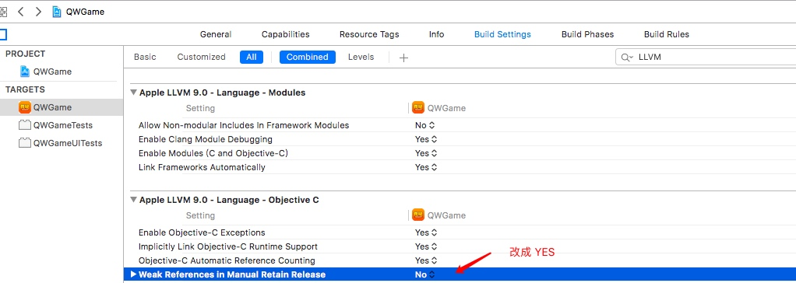
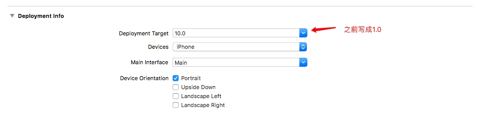

# 2018.01.05 - 工作总结
## 项目报错
#### - 1. 报错描述：

```
Cannot synthesize weak property because the current deployment target does not support weak references
```
- 解决办法：
    - 项目 -> ==TARGETS== -> ==IOS== -> ==Build Settings== -> ==Apple LLVM 9.0 - Language - Objective C== -> ==WeakReferences inManual Retain Release== 改为 ==YES==

    

#### - 2. 报错描述：

```
-fobjc-weak is not supported on the current deployment target
```
 


- 原因是这样：

    - ios5.0以下不支持弱类型，你的target版本肯定是5.0以下的；


## 马甲包相关事项
#### 一、 App Store上架费用，要多少钱。

这个因产品而异，一般是6000-10000元人民币。

#### 二、 App Store上架周期，要多久过。

这个因产品而异，正常的话一周内，如果产品老是出问题,被苹果拒绝就不好说了，一般情况下，我们的客户两周内过审，问题不大。

#### 三、 App Store上架流程

1. 提交
2. 审核
3. 审核通过/审核不通过，被拒解决方案
4. 上架

#### 四、APP上架常见问题

1. 之前做过哪些包？有案例吗？
 - 彩票的，贷款的，理财的，游戏的，都做过。

2. 客户需要提供什么？
 - 1 告知我们无法上架的原因。
 - 2. 是首发还是更新被拒。
 - 3. 找个技术负责人，拉群对接下，帮助修改产品

3. 棋牌类、彩票类能上架吗？
 - 可以

4. 上架和加速审核有什么区别？
 - 上架是指客户的产品能够在appstore里展示
 - 加速审核是使APP进入审核的绿色通道，加快审核速度，让苹果尽快出审核结果，时间可由数天缩短到2-48小时内（节假日除外），不保证上架成功。
 
5. 需要改代码的，姑婆可以帮客户改吗？
 - 我们提供指导协助，有些源码我们可以提供，具体我们可跟客户的iOS开发详聊
 
6. 金融，夺宝，直播，捕鱼，游戏，电商，旅游，汽车这几类产品都可以做苹果上架吗？
 - 可以，成功率基本100%，并且游戏不需要版号，金融个人开发者也可以成功上传。
 
7. 一般多久可以上架成功？
 
 - 一般3周
 - 有两种情况需要注意下哦，
        - （1）如果客户拖延时间一直不提交，耽误的时间不算在内
        - （2）如果出现新的被拒问题，时间要相应增加
 
8. 金融类贷款，没有资质能不能上架？
 - 可以的
 
9. 姑婆可以提供账号，上好架把包转给客户吗？
 - 可以的
 
10. 金融理财产品，什么都没有，能不能做？
 - 可以，提供部分素材，并说明要求即可
 
#### 五、App Store上架条件

1.  软件正常。
 - 这里指的是没有bug，符合苹果的条件。
2.  提交审核。
3.  审核通过。

#### 六、App Store上架是什么

 - 这里指的是ios的商店，app store上架指的是ios的软件从提交申请到上线的整个过程，它的目的是让软件展示在app store上，获取app store过来的流量，用户，从而获取收入。

#### 七、 App Store上架被拒原因

1. 截图中出现了Android
2. 截图中出现了hack苹果的内容
3. 评论中出现了“屌丝”等不雅词汇
4. App中包含谈论Android系统的内容
5. 你修改了状态栏，不行
6. 只有第三方登录，没有自己的注册登陆功能，不行
7. 您的应用包括色情内容（色情交易，色情展示）
8. 有微信分享功能，结果因为要强制用户安装微信，才能使用该功能，被拒
9. 应用内用了圆角按钮，无情被拒
10. 你给我解释解释，应用里的积分从哪里来，到哪里去？
11. 应用里面表示有广告，但是审核者玩了后说没广告，后来申述成功，因为第二次游戏的时候才会出现广告（虐心重复向游戏），你丫就不能玩两遍么，一遍就几十秒~~
12. 有第三方支付（支付宝）果断被拒！！！
13. 因为集成了友盟 友盟获取用户mac地址被拒了。
14. 您的内容因为没有举报功能、含有色情内容不能通过。
15. 使用第三方的logo被拒(由于涉及到联通运营方面 果断在关于里面加了个联通的logo 标识合作伙伴 果断被拒 要求提供联通的书面证明。)
16. 没给测试帐号
17. QR CODE里边有android的下载地址（直接转跳iTunes后通过）
18. 不符合iOS UI审美观（改UI）
19. 只有第三方登陆，没有自己的注册登陆功能...（新增登陆注册功能通过）
20. 你的软件加了强制评论功能：就一个按钮点击进入评论，必须改成先提示框提醒用户是否进入评论.
21. 存放文档的地方由于iCloud会自动备份而被拒绝，只有用户自己使用和创建出来的才允许放在Document文件夹下。
22. 审核员打不开我的接口，换海外vps，过最蛋疼的。
23. 因为截图里面放了iPhone的模型被拒。
24. 游戏运行崩溃；
25. 游戏截图中有“测试字样”；
26. 游戏太简单；
27. 一次提交多个相同的游戏；
28. 游戏中使用其他版权图片（使用了flappybird原图）
29. 加了广告框架，游戏中缺没有广告显示（其实是在game over时候显示，结果测试人员就一直不知道怎么能死）；
30. 内购不能使用；
31. game center不能使用。
32. App Store显示名字和软件名称不符合。
33. 支付时不得强制获取用户信息（比如 登陆、注册），必须在看到价格之前让用户登陆、注册。
34. App内购，产品类型不对。
35. 内购没有Restore按钮；
36. 有登陆注册功能，但没有提供测试账户（大意了）
37. 有去除广告的按钮，但没发现有广告。(后来截了个图，回复审核那边，两小时之内就通过审核了)
38. 版权问题。没有提供相关的版权文件
39. 评级问题：提交的时候是评级4星，后来被拒，改成12星，通过审核了。
40. 关键字不符合要求
41. 内容太简单，说是浪费用户时间
42. 界面风格不符合iOS风格
43. 应用评级，从4+改成12+，再改成16+最后说我不符合16+，我再改回4+，竟然过了...
44. Splash上放了个蝙蝠侠蜘蛛侠，版权问题未给通过，后让UI改画了一个猥琐男人，通过了。
45. 应用内有个保存图片至相册的按钮，然后plist里有个Application supports iTunes file sharing设为了yes，无情被拒。
46. 用户在应用里自己下载的文档都不能存放在Document文件夹下，被拒。
47. 为了获得审查应用程序的完整功能，我们需要相关的硬件。 我以前都是录制一个操作视频上传然后就通过了，这回我录了2次都是相同的回复，不知道抽什么风。
48. 做了款社交的软件，上线的时候没有提供账号和密码，导致审核的时候进不去,reject. ps:那么大个注册 看不到么？看不到么？
49. 论坛模块里由用户发的活动贴提到安卓平台和WP平台被拒，然后我说我没问题，他说三个工作日之内电话联系，过去4-5天了，还没联系。
50. 按钮位置不符合ios风格。
51. 一个笑话APP，开机画面上有“逗比”这两个字，苹果审核说含有粗俗不文明的文字，然后被拒了。
52. QQ登陆功能，但是没下载QQ就不行。
53. 第一次没有给用户举报的功能。加了只有新浪和qq登录没有自己的登录注册系统（QQ SDK的没装QQ提示的是下载）。好像还有没有用户协议巴拉巴拉，反正那次审核就耗一月的时间。
54. 审核人员打开app无法加载内容，一般是因为国内服务器的问题。解决方法是录个app的操作视频，放到youtube上，发给苹果，屡试不爽。
55. 界面太丑被拒，换了张背景图通过了。
56. iPad 写成了IPad。
57. 没提供注册功能，被拒...开放注册通过；
58. 按钮图片类似iPhone桌面图标被拒；
59. 因为iCloud云备份的问题被拒绝，将备份功能关闭通过。
60. 使用第三方SDK，有个提示信息遮挡了状态栏。
61. 图片上有链接。
62. 因为有android关键字被拒绝了，因为描述中有android关键字被拒绝了，因为有swfit关键字是个没发布的语言被拒绝了。因为按钮点击无效被拒绝了。
63. 内容包含苹果产品iPad
64. 有竖中指的图片
65. IDFA展示广告没有提供视频
66. 注册页未添加pravicy声明文件。
67. iTunes升级后，分级莫名奇妙由12+变成了4+。
68. 用了显眼的词语,其实就是"Beautiful girl"之类的，说内容令人反感。
69. 引导页文案与内容不符。
70. 因为应用截图被拒。美术偷懒给了4张android的截图，虽然app内容是一样的，但是顶部的状态栏是Android的！
71. 名字不符合，包含不良信息，包含与当前app不符的内容，包含特殊含义的歧义字符
72. App中有积分墙
73. App中有第三方支付(如短信支付，积分墙支付)
74. App的功能过于单一或仅仅是一个demo
75. 在注册时强制获取用户信息
76. 需要提供原作者的版权授权书
77. App中有IAP内购，但是没有恢复内购的按钮
78. 强制玩家给App评5星好评
79. 没有兼容iOS
80. 做了一款智能家居的应用，没有提供应用控制智能设备的视频地址没拒，每一次提交新版都要确保你的视频地址是否有效，有一次我就没有确认(YouTube的个人视频上传之后如果不设置成公共视频过一段时间就会转为私有的，除了自己别人无法访问)，然后视频地址刚好无效了。。。
81. 资讯客户端焦点图放出了盘古破解iOS8越狱的新闻。。
82. 截图中出现一只玩具企鹅，然后拒绝说我们发现这个营销截图不能充分反映你的应用使用
83. 成人应用可以上架AppStore：内容必须“有用”

#### 八、App Store上架的常入的坑

1. 最近的一次，因为App界面里出现“无节操”的字眼，被拒了。理由是：不雅词汇，使用户不适。我真是无力吐槽啊，也没法当面对质，好吧，我改成了“闹着玩”后审核通过。

2. 上一次，App里加了个不完美的功能，于是加了个“beta”的字样，然后被打回了，说是App里不应包含测试版的功能，不能出现“beta”字样，好吧，我写了个代码，判断审核期里不显示beta，上架后再继续显示。不过后来每次审核，都没人再管里面的beta字样，估计是因为审核的人不一样吧，关注点不同。iOS大小写写错了被打回。在简介里如果涉及到苹果的商标或者词汇，一定一个字母都不能错，包括每个字母的大小写。

3. 引导用户好评，差点被封号。事情是这样的，我在微博发了条微博说去AppStore评论有奖品送，不知道被举报了还是咋滴，苹果发了个邮件说不允许鼓励评论，然后还有一个加拿大的电话打过来跟我确认情况，我说了情况后，她说下不为例即可，还是很nice的。全程中文沟通。对了，在苹果所有涉及审核上架邮件沟通等环节，尽管使用中文，他们有专人负责的。

4. 没有提供测试账号。这个当时有点莫名其妙的，其实我的App不需要测试账号，后来随便填了个，然后就过了。

5. 没有隐私声明。因为我是输入法，这个是必须提供的，我后来从搜狗输入法那里copy过来改了改放在自己服务器上的。

6. 第三方输入法必须提供数字输入的功能。这个我也觉得有点莫名其妙，但是必须要加入，之前做的时候没有看条款，最后因为这个，我错过了第三方输入法第一波上架潮，iOS8正式版出来后，落后了好几个周才上架。

7. 有一次不小心在界面里出现了成人词汇，但是我的App是4+评级的，于是被打回，后来我把评级临时提高了才通过。

8. 我努力回忆，暂时只记起这些，都是很低级的错误，大家也可以一起来补充。

另外，再说一个诀窍：提交App，一定要利用好Expedite Review这个东西，所谓Expedite Review，就是申请快速Review，一般通过后，提交当天就可以通过审核。不过前提是你能描述出你的App线上版本存在重大bug。你可以故意留点bug，或者是真的有bug，或者是故意夸大一下你的bug描述，通过的几率还是挺高的，半年来我至少通过了四五次。提交地址是Sign in with your Apple

#### 九、App Store上架建议

1. 文字描述不能越界，apple 首先看文字描述，如果不过关，直接拒绝；脱离开苹果的宣传是另外一回事；

2. 苹果默认采取的是最小策略：硬件需求最小化；审核的时候会最大化的关闭硬件参数，如果没有在app 中直接说明的话。如果你使用了wifi ，gps 等设备一定要在参数中说明，他们才不会管你是运行于ipad wifi还是ipad wifi+3G.你参数中没有说明的他统统不管；如果你要播放超过10分钟的声频，注意苹果是另外有要求的；

3. 特别注意各种Crash,比如联网异常导致的Crash；正常使用GPS硬件的时候，始终是会有经纬度数据的，但是苹果审核的时候就是没有。 哥没有做判断，于是Crash了。 被拒

4. 7天原则，绝大部分都是需要7天的。虽然有狗屎运的四个小时就通过了，但是不要指望；我曾经以为苹果遵循的是先进后出原则，于是半夜2点上传app.谁知道还是不行；不过，每个账号有两次机会申请加急处理；

5. 苹果的随意性很强，不同工程师审核的时候把握的度是不一样的；你会看到很多app 比你做得还垃圾怎么进了app store .没话说，人品问题；

6. 如果已经申请上架，但是发现了Bug或者其他问题。建议还是自己打回来，不要等苹果来拒绝了；

7. 要想避免各种被拒绝的情况，最好的办法就是阅读苹果的条例！可是亲啊，那个英文TA认识我，我不完全认识TA啊，而且太长了，太长了！


