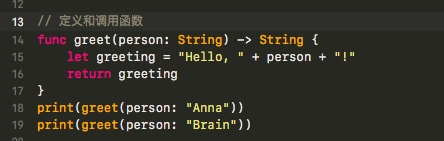
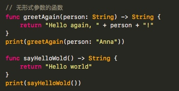
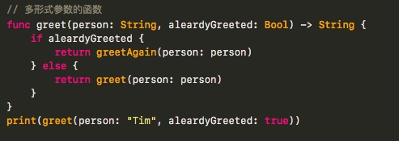

# 2018.01.17 - 工作总结
## while 循环
- While 循环执行一个合集的语句指导条件变成 False。

- 这种循环最好在第一次循环之后还有未知数量的遍历时使用。

- Swift 提供了**两种 while 循环**：
 - While 在每次循环开始的时候计算它自己的条件；

 ```
while condition {
 
    statements
 
 } 
 ```
 - repeat-while 在每次循环结束的时候计算它自己的条件。 

    ```
    repeat {
    
        statements
    
    } while condition
    ```
## 条件语句
- Swift 提供了两种方法来给你的代码添加条件分支，就是所谓的 if 语句和 switch 语句。

- if 语句来判定简单的条件，比如少量的可能性。 

- switch 语句则适合更复杂的条件，比如多个可能的组合，并且在模式匹配的情况下更加有用，可以帮你选择一段合适的代码分支来执行。

 ```
 switch some value to consider {
    case value 1:
        respond to value 1
    case value 2,
    value 3:
        respond to value 2 or 3
    default:
        otherwise, do something else
}
 ```

## 函数
 






## SDK开发
[]()


