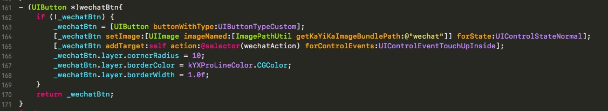
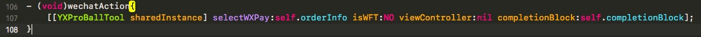

---
layout: post
title: "工作总结"
date: 2019.01.23
description: "HEXO配置，HEXO+Github，搭建自己的博客"
tag: 博客 
---   
## 支付问题
- 微信支付



<!--- [iOS_抓娃娃SDK使用文档10.1](media/15166763998887/iOS_%E6%8A%93%E5%A8%83%E5%A8%83SDK%E4%BD%BF%E7%94%A8%E6%96%87%E6%A1%A310.1.pdf)-->

## Hexo 搭建博客

### 配置环境

- 安装 Node（==必须==）

 - ==作用==：用来生成静态页面的 到 Node.js 官网下载相应平台的最新版本，一路安装即可。

- 安装Git（==必须==）

 - ==作用==：把本地的 hexo 内容提交到 github 上去. 安装 Xcode 就自带有 Git，我就不多说了。

- 申请GitHub（==必须==）

 - ==作用==：是用来做博客的远程创库、域名、服务器之类的，怎么与本地 hexo 建立连接等下讲。 github 账号我也不再啰嗦了,没有的话直接申请就行了，跟一般的注册账号差不多，SSH Keys，看你自己了，可以不配制，不配置的话以后每次对自己的博客有改动提交的时候就要手动输入账号密码，配置了就不需要了，怎么配置我就不多说了，网上有很多教程。

### 正式安装HEXO　

1 - Node 和 Git 都安装好后，可执行如下命令安装 hexo：

```
$ sudo npm install -g hexo
```
2 - 初始化

 - 创建一个文件夹，如：Blog，cd 到 Blog 里执行 hexo init 的。命令：

```
hexo init
```
 - 好啦，至此，全部安装工作已经完成！

3 - 生成静态页面

 - 继续再Blog目录下执行如下命令，生成静态页面

```
hexo generate （hexo g  也可以）   
```

4.本地启动

- 启动本地服务，进行文章预览调试，命令：

```
hexo server   
```
- 浏览器输入 http://localhost:4000 我不知道你们能不能，反正我不能，因为我还有环境没配置好

vim _config.yml
翻到最下面，改成我这样子的，注意： : 后面要有空格

## 配置Github
### 建立Repository

- 建立与你用户名对应的仓库，仓库名必须为==【your_user_name.github.io】==，固定写法 然后建立关联，我的Blog在本地/Users/Desktop/Blog，Blog是我之前建的东西也全在这里面，有：

```
Blog 
　｜ 
　｜－－ _config.yml 
　｜－－ node_modules 
　｜－－ public 
　｜－－ source 
　｜－－ db.json	
　｜－－ package.json 
　｜－－ scaffolds 
　｜－－ themes 
```
　　　　　　 　　　
- 现在我们需要 ==_config.yml== 文件，来建立关联，命令：

```
deploy:
  type: git
  repository: https://github.com/leopardpan/leopardpan.github.io.git
  branch: master
```
- 执行如下命令才能使用git部署

```
npm install hexo-deployer-git --save
```

- 网上会有很多说法，有的type是github, 还有repository 最后面的后缀也不一样，是github.com.git，我也踩了很多坑，我现在的版本是hexo: 3.1.1，执行命令hexo -vsersion就出来了,貌似3.0后全部改成我上面这种格式了。 忘了说了，我没用SSH Keys如果你用了SSH Keys的话直接在github里复制SSH的就行了，总共就两种协议，相信你懂的。 然后，执行配置命令：

```
hexo deploy
```

- 然后再浏览器中输入 ==http://your_name.github.io/== 就行了，我的 github 的账户叫 ==xiaoxinhai== ,把这个改成你 github 的账户名就行了

### 部署步骤

- 每次部署的步骤，可按以下三步来进行。

```
hexo clean
hexo generate
hexo deploy
```

- 一些常用命令：

```
hexo new "postName"         # 新建文章
hexo new page "pageName"    # 新建页面
hexo generate               # 生成静态页面至public目录
hexo server                 # 开启预览访问端口（默认端口4000，'ctrl + c'关闭server）
hexo deploy                 # 将.deploy目录部署到GitHub
hexo help                   # 查看帮助
hexo version                # 查看Hexo的版本
```

